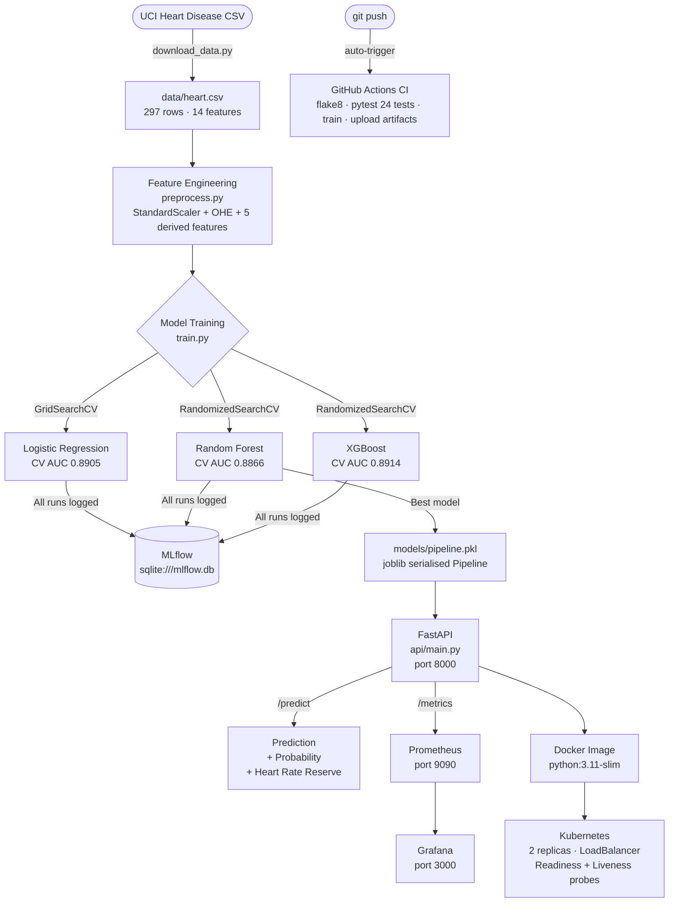

<div align="center">

[](https://github.com/Swathi-A01/heart-disease-mlops)

<br/>


<br/>

> **Predict heart disease risk from clinical patient data — trained, tracked, containerised, deployed, and monitored.**
> Built as a full MLOps pipeline for BITS Pilani AIMLCZG523 Assignment 01.

</div>

---

## System Architecture



---

## Quick Start

```bash
# 1. Clone and install
git clone https://github.com/Swathi-A01/heart-disease-mlops.git
cd heart-disease-mlops
make install

# 2. Download data and train models
make train

# 3. Run the API
make serve
# → http://localhost:8000/docs

# 4. Or boot the entire stack (API + MLflow + Prometheus + Grafana)
make stack-up
# → API:        http://localhost:8000/docs
# → MLflow:     http://localhost:5001
# → Prometheus: http://localhost:9090
# → Grafana:    http://localhost:3000  (admin/admin)
```

---

## Features

- [x] **Clinical feature engineering** — heart rate reserve (JNC-8), BP categories, cholesterol risk tiers (ATP III)
- [x] **3 models compared** — Logistic Regression, Random Forest, XGBoost with GridSearch/RandomizedSearchCV
- [x] **MLflow experiment tracking** — parameters, metrics, confusion matrix, ROC curves, PR curves, calibration plots
- [x] **FastAPI serving** — `/predict`, `/predict-batch` (up to 100 patients), `/model-info`, `/stats`, `/health`, `/ready`
- [x] **24 pytest tests** — data integrity, feature formulas, API endpoints, response time, batch validation
- [x] **GitHub Actions CI** — lint → test → train → upload artifacts on every push
- [x] **Docker** — self-contained image, trains model at build time, HEALTHCHECK
- [x] **Kubernetes** — 2 replicas, readiness/liveness probes, LoadBalancer service
- [x] **Prometheus + Grafana** — request rate, latency histograms, custom `heart_risk_predictions_total` counter
- [x] **Standalone scripts** — `predict.py` (CLI inference) and `evaluate.py` (model comparison report)

---

## API Endpoints

| Method | Endpoint | Description |
|--------|----------|-------------|
| `POST` | `/predict` | Single patient — returns prediction, probability, risk, heart rate reserve |
| `POST` | `/predict-batch` | Batch up to 100 patients with aggregate summary |
| `GET` | `/model-info` | Model type, feature list, dataset info |
| `GET` | `/stats` | Live prediction counts and high-risk rate since startup |
| `GET` | `/health` | Liveness check |
| `GET` | `/ready` | Readiness check — confirms model is loaded |
| `GET` | `/metrics` | Prometheus metrics |
| `GET` | `/docs` | Swagger UI |

### Sample request

```bash
curl -X POST http://localhost:8000/predict \
  -H "Content-Type: application/json" \
  -d '{
    "age": 67, "sex": 1, "cp": 4, "trestbps": 160, "chol": 286,
    "fbs": 0, "restecg": 2, "thalach": 108, "exang": 1,
    "oldpeak": 1.5, "slope": 2, "ca": 3, "thal": 7
  }'
```

```json
{
  "prediction": 1,
  "probability": 0.9982,
  "risk": "high",
  "heart_rate_reserve": 45.0,
  "age_thalach_ratio": 1.6119
}
```

---

## Project Structure

```
heart-disease-mlops/
├── .github/workflows/ci.yml     ← GitHub Actions: lint → test → train → upload
├── data/
│   ├── download_data.py         ← fetch UCI dataset, binarise target
│   └── heart.csv                ← 297 rows, 14 features
├── notebooks/
│   └── 01_eda.ipynb             ← 12-section EDA, 17 visualisations
├── src/
│   ├── preprocess.py            ← ColumnTransformer + 5 clinical derived features
│   ├── train.py                 ← 3 models, tuning, MLflow, 9 plot types
│   ├── predict.py               ← standalone CLI inference
│   └── evaluate.py              ← model comparison report
├── api/
│   └── main.py                  ← FastAPI: 7 endpoints + Prometheus metrics
├── tests/
│   ├── conftest.py              ← shared session-scoped fixtures
│   ├── test_preprocess.py       ← 10 tests
│   └── test_api.py              ← 14 tests
├── k8s/
│   ├── deployment.yaml          ← 2 replicas, health probes, resource limits
│   └── service.yaml             ← LoadBalancer port 80 → 8000
├── monitoring/
│   ├── prometheus.yml           ← scrape config
│   ├── docker-compose.yml       ← Prometheus + Grafana stack
│   └── grafana-dashboard.json   ← pre-built 4-panel dashboard
├── plots/                       ← 27 visualisations (EDA + training)
├── screenshots/                 ← 20 evidence screenshots
├── Dockerfile                   ← python:3.11-slim, trains at build time
├── docker-compose.full.yml      ← full stack: API + MLflow + Prometheus + Grafana
├── Makefile                     ← install/train/serve/test/lint/stack-up
├── requirements.txt             ← 16 pinned dependencies
└── Heart_Disease_MLOps_Report.docx
```

---

## Model Results

| Model | CV ROC-AUC | Test ROC-AUC | Accuracy | F1 |
|-------|-----------|-------------|----------|----|
| Logistic Regression | 0.8905 | 0.9397 | 0.850 | 0.836 |
| **Random Forest** ★ | **0.8866** | **0.9464** | **0.833** | **0.808** |
| XGBoost | 0.8914 | 0.9252 | 0.850 | 0.830 |

★ Selected as production model (highest test ROC-AUC)

---

## Running Tests

```bash
make test          # run all 24 tests
make lint          # flake8 check
make evaluate      # model comparison report
```

---

## Kubernetes Deployment

```bash
# Enable Kubernetes in Docker Desktop first
make k8s-deploy
kubectl get pods    # 2 pods Running
kubectl get svc     # LoadBalancer on port 80
curl http://localhost/health
```

---

<details>
<summary><b>Full environment setup</b></summary>

```bash
# With venv
python -m venv venv
source venv/bin/activate
pip install -r requirements.txt

# With conda
conda create -n heart-mlops python=3.11
conda activate heart-mlops
pip install -r requirements.txt
```

</details>

<details>
<summary><b>MLflow UI</b></summary>

```bash
mlflow ui --backend-store-uri sqlite:///mlflow.db --port 5000
# Open http://localhost:5000
# Experiment: heart-disease-classification
# 3 runs: logistic_regression, random_forest, xgboost
```

</details>

<details>
<summary><b>Standalone prediction (no API required)</b></summary>

```bash
# Single patient
python src/predict.py \
  --age 67 --sex 1 --cp 4 --trestbps 160 --chol 286 \
  --fbs 0 --restecg 2 --thalach 108 --exang 1 \
  --oldpeak 1.5 --slope 2 --ca 3 --thal 7

# Batch from CSV
python src/predict.py --input data/heart.csv --output predictions.csv
```

</details>

---

## Dataset

UCI Heart Disease (Cleveland) — [archive.ics.uci.edu](https://archive.ics.uci.edu/ml/datasets/Heart+Disease)

303 patients · 13 clinical features · binary target (0 = no disease, 1 = disease)

---

<div align="center">
Built for BITS Pilani MTech AI/ML — AIMLCZG523 Assignment 01
</div>
